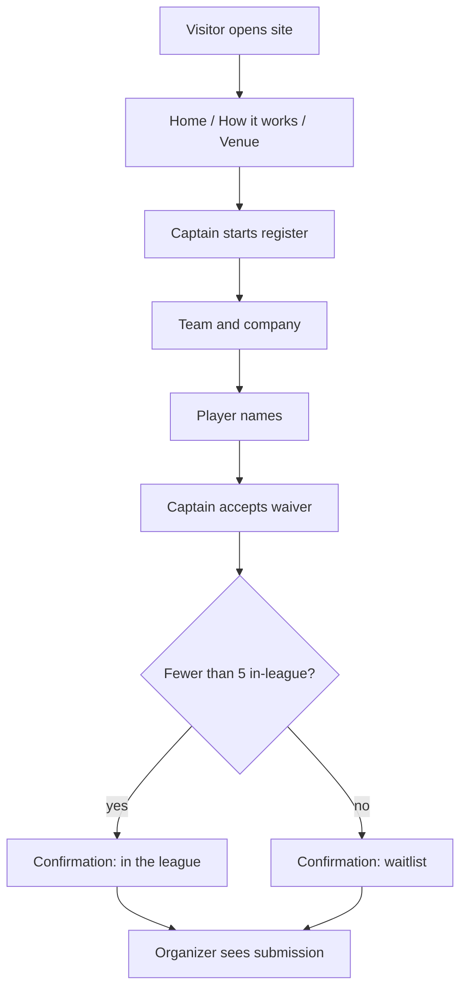
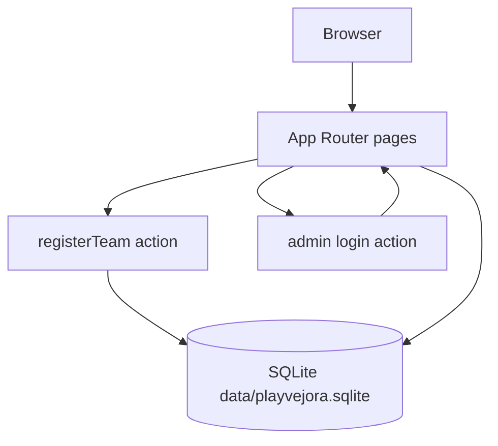

# PlayVejora v1 Public Site - Plan

## Goal Capsule

- **Objective:** Ship a shareable PlayVejora site for the first Edinburgh after-work football league so a company-side captain can register a team (with waitlist after five) and organizers can review submissions privately.
- **Product authority:** This plan owns v1 public pages, captain registration, waiver, private admin, and a repo architecture note for later features. Surrounding league-platform areas are not active scope.
- **Open blockers:** None. Venue details stay unpublished until known. Match format stays generic.
- **Stop conditions:** Stop if the work expands into Stripe, stats, extra cities on the live site, participant logins, or a CMS. Stop if SQLite cannot run on the intended host and a hosted database is required — that is a follow-up, not a silent swap.
- **Execution profile:** Greenfield Next.js app. Implement units in dependency order. Prove waitlist assignment and waiver gating with automated tests before treating registration as done.
- **Tail ownership:** One implementer (human or `ce-work`) owns scaffold through architecture note. Do not split public pages and registration across uncoordinated agents without sharing the design tokens and data layer from U1 and U3.

**Product Contract preservation:** Product Contract unchanged.

---

## Product Contract

### Summary

PlayVejora v1 is a React public site for an Edinburgh after-work football league: home, how it works, venue/rules/safety (venue TBC), and a short captain registration path that ends in league place or waitlist. Organizers review entries in a private admin. A repo architecture note describes how later features plug in without appearing on the live site yet.

### Problem Frame

Workplace sides currently have no single place that explains this league, takes a team in, and records that they accepted the risks. Organizers otherwise chase details over chat and cannot tell who is in the five versus waiting. The first city is Edinburgh; more cities come later, so v1 must not pretend those cities exist on the site.

### Key Decisions

- **Captain registers the whole team.** (session-settled: user-directed — chosen over per-player signup or captain-then-players: one form fits a five-team after-work league.) Governs R6, R7, R8.
- **No player or public logins in v1.** (session-settled: user-directed — chosen over accounts for participants: signup is registration, not membership.) Governs R6, R11.
- **Collect registration without Stripe.** (session-settled: user-directed — chosen over day-one checkout: payment waits.) Governs R6, R10.
- **Waitlist after five Edinburgh teams.** (session-settled: user-directed — chosen over a hard close or uncapped intake: first five are in; later submissions still arrive as waitlist.) Governs R9, R12.
- **Edinburgh only on the live site.** (session-settled: user-directed — chosen over a city picker now: other cities are architecture later, not UI now.) Governs R2, R4, R9.
- **Short registration path, not one long page.** (session-settled: user-approved — chosen over a brochure long form or a mini league OS: waiver and waitlist stay obvious.) Governs R6, R8, F1.
- **Captain accepts the waiver for the whole team.** (session-settled: user-directed — chosen over per-player later signing: one acceptance during register.) Governs R8.
- **Company-first, friends/mixed allowed.** (session-settled: user-directed — chosen over company-only or anyone-with-optional-company: company is expected, not required.) Governs R7.
- **Sport-energy look.** (session-settled: user-directed — chosen over quiet editorial, warm social, or dark minimal: clean UI with pitch/green and light match-day feel.) Governs R1, R3.
- **Private admin, not public team names or email-only.** (session-settled: user-directed — chosen over email-only or a public teams list: organizers review submissions themselves.) Governs R11, R12.
- **Flexible player list.** Match format is unset, so the form does not lock a squad size. Governs R7.
- **Architecture note in the repo.** Future tasks reuse one extension pattern. Governs R13.

### Requirements

**Presence and look**

- R1. The site is a React web app with a minimal, easy interface and a clean sport-energy aesthetic (pitch/green, restrained match-day feel, not a busy sports portal).
- R2. All public copy treats the live league as Edinburgh only. Venue is published as to be confirmed, never a fabricated address.

**Public pages**

- R3. Visitors can open Home, How it works, Venue / rules / safety, and Register without creating an account.
- R4. Venue / rules / safety states Edinburgh, venue TBC, generic football rules and safety notes, and that format will be confirmed later.
- R5. How it works explains after-work company play, that a captain registers the team, the five-team then waitlist rule, and that payment is not collected on this site yet.

**Registration**

- R6. A captain completes registration in a short sequence: team and company, player names, waiver, confirmation. There is no participant login.
- R7. The form captures team name (required), company (optional, with space to note a friends or mixed side), captain contact email (required), and a flexible list of player names with no fixed squad size.
- R8. The captain must read the waiver and accept it on behalf of the listed team before submit. Placeholder waiver copy is enough for v1; organizers replace it later.
- R9. The first five complete Edinburgh submissions are in the league. Further complete submissions are accepted as waitlist. Per R2, this cap is the only live league.
- R10. The flow does not collect payment or send the captain to Stripe.

**Organizer admin**

- R11. Organizers open a private admin (not linked as a public nav item) and see submitted teams without participant logins.
- R12. Admin lists each team as in-league or waitlist, in submission order, with the fields from R7 plus waiver-accepted.

**Extension for later work**

- R13. The repo contains an architecture note describing how later features attach (more cities, Stripe, match stats, photos/awards, `/origin`, charity choice, top-scorers page) without implementing those features in v1.

### Actors

- A1. Visitor — anyone reading the public site.
- A2. Captain — the person registering one team.
- A3. Organizer — the people running PlayVejora who review submissions.

### Key Flows



- F1. Captain registers a team
  - **Trigger:** A2 chooses Register.
  - **Actors:** A2, A3
  - **Steps:** A2 enters team/company/contact, lists players, accepts waiver for the team, submits. Site records in-league or waitlist per R9 and shows that outcome. A3 can open the same record in admin.
  - **Covered by:** R6, R7, R8, R9, R10, R11, R12
- F2. Visitor learns the league
  - **Trigger:** A1 lands on the site.
  - **Actors:** A1
  - **Steps:** A1 reads Home, How it works, and Venue / rules / safety, then may start F1.
  - **Covered by:** R3, R4, R5
- F3. Organizer reviews intake
  - **Trigger:** A3 opens private admin.
  - **Actors:** A3
  - **Steps:** A3 sees teams in submission order with in-league vs waitlist and waiver-accepted.
  - **Covered by:** R11, R12

### Acceptance Examples

- AE1. Fifth then sixth team
  - **Covers R9, R12.**
  - **Given:** Four complete in-league teams exist.
  - **When:** A fifth captain completes registration, then a sixth does.
  - **Then:** The fifth is in-league. The sixth is waitlist. Admin shows both with those labels in submission order.
- AE2. Friends side without a company
  - **Covers R7.**
  - **Given:** A captain has a mixed/friends team.
  - **When:** They omit company and mark it as friends/mixed, filling team name, email, and player names.
  - **Then:** Submit succeeds. Admin shows the team without a company name.
- AE3. Waiver skipped
  - **Covers R8.**
  - **Given:** A captain has filled team details.
  - **When:** They try to submit without accepting the waiver.
  - **Then:** Submit is blocked. No in-league or waitlist record is created.
- AE4. No payment step
  - **Covers R10.**
  - **Given:** A captain is in the registration path.
  - **When:** They complete F1.
  - **Then:** They never see a payment or Stripe step.
- AE5. Other cities not offered
  - **Covers R2, R9.**
  - **Given:** A visitor is on any public page or the form.
  - **When:** They look for another city.
  - **Then:** No city picker or other-city league is shown. Copy is Edinburgh only.

### Success Criteria

- A company contact can understand the league from the public pages and would be willing to share the link.
- A captain can finish registration and waiver, and an organizer can see that team as in-league or waitlist in private admin.
- The architecture note is in the repo and names the deferred features in R13 so a later task can extend without reversing v1 behavior.

### Scope Boundaries

**Deferred for later**

- Stripe checkout
- Live match stats and post-game updates
- Photo gallery and awards (trophy, best player, top scorer, best keeper, and later add/remove)
- `/origin` founder story
- Charity choice tied to the winning side (support in some form, no amounts)
- SEO search-intent document
- Players page with top-3 scorers and photos
- More cities on the live site
- Other sports
- Per-player waiver links and participant accounts

**Outside this product's identity**

- A general social network or company intranet
- A public login product whose purpose is membership rather than league intake

### Deferred to Follow-Up Work

- Hosted database if the deploy target is ephemeral (Vercel-style) and cannot keep `data/playvejora.sqlite`
- Email notify-on-submit for organizers
- Production-grade session store and rate limiting on register and admin login

<!-- ce-section: work-relationships -->
### How This Work Fits Together

This plan owns PlayVejora v1 (public Edinburgh site, captain registration, waiver, private admin, architecture note). The list below is the current understanding of surrounding work, not a committed roadmap.

- Later city expansion
  - Depends on v1 Edinburgh intake and the architecture note (R13)
  - Still to decide: per-city caps vs a shared waitlist
- Stripe registration payment
  - Depends on v1 form fields and waitlist rules
  - Shares captain-as-payer with R6
- Match stats, photos/awards, top-scorers page
  - Can proceed independently of Stripe once games exist
  - Depends on having teams from v1 intake
- Origin, charity, SEO document
  - Can proceed independently of the registration engine
  - Shares PlayVejora positioning with R5

### Dependencies / Assumptions

- Organizers will supply or replace waiver wording before any real season use; v1 may ship placeholder legal-style text.
- Captain email is the contact channel; phone is not required.
- "Five teams" counts complete submissions that accepted the waiver, not abandoned drafts.
- Expanding to more cities later must not require throwing away v1 pages; the architecture note (R13) is the contract for that, not a city UI in this release.
- v1 is run as a Node server with a persistent disk (`next start` or equivalent), not as a diskless serverless function.

---

## Planning Contract

### Key Technical Decisions

- KTD1. **Next.js App Router (TypeScript) as the single React app and server.** (session-settled: user-approved — chosen over a Vite SPA plus a separate API: one process serves pages, register, and admin.) Governs how R1, R3, R6, R11 are built.
- KTD2. **SQLite file at `data/playvejora.sqlite` via `better-sqlite3`, writes in a transaction.** (session-settled: user-approved — chosen over JSON or in-memory: waitlist survives restart.) Governs how R9, R12 persist. Cite R9 for the five-team rule. Do not use Vercel serverless for this store.
- KTD3. **Admin is a shared password in `ADMIN_PASSWORD`, cookie session after POST login.** (session-settled: user-approved — chosen over secret URL only: a guessed `/admin` path must not list PII.) Governs how R11 is gated. No public nav link to admin (R11).
- KTD4. **Confirmation copy is only in-league or waitlist, with no queue number.** (session-settled: user-approved — chosen over showing position: R9 needs the status, not rank.) Instantiates F1 confirmation.
- KTD5. **Player names are repeatable rows (add/remove), at least one name required.** Instantiates R7 flexible list.
- KTD6. **Waiver body lives in `content/waiver.md` and is rendered on the waiver step.** Instantiates R8 placeholder copy.
- KTD7. **Vitest plus React Testing Library.** Domain tests own waitlist assignment. Component tests own waiver block and no-payment path. Instantiates AE1–AE4.
- KTD8. **Live league city is the constant `edinburgh` on each row, not a UI picker.** Instantiates R2 and R13. Schema may keep a `city` column for later work.

### High-Level Technical Design

Public routes are unauthenticated. Register posts to a server action that assigns status. Admin routes require the session cookie.



Waitlist assignment (directional, not an implementation spec): begin a write transaction; count rows with `status = in_league` and `city = edinburgh`; if count is under 5 insert `in_league`, else insert `waitlist`; commit.

### Output Structure

```text
app/
  layout.tsx
  page.tsx
  how-it-works/page.tsx
  venue/page.tsx
  register/page.tsx
  admin/login/page.tsx
  admin/page.tsx
  globals.css
content/
  waiver.md
lib/
  db.ts
  registration.ts
  admin-auth.ts
data/
  playvejora.sqlite          gitignored; created at runtime
docs/
  architecture/playvejora-extension-pattern.md
  plans/2026-09-08-001-feat-playvejora-v1-plan.md
lib/registration.test.ts
app/register/register-flow.test.tsx
app/admin/admin-gate.test.tsx
```

The tree is a scope sketch. Per-unit `Files` lists are authoritative.

### Implementation Constraints

- Do not add source comments unless the repo already shows the same kind of comment in similar code (greenfield: do not add comments).
- Do not add Stripe, Origin, stats, photos, charity, or extra city UI.
- Gitignore `data/` and `.env*`. Commit `.env.example` with `ADMIN_PASSWORD`.
- Public nav: Home, How it works, Venue, Register only.

### Sequencing

U1 → U2 and U3 in parallel after U1 → U4 depends on U1 and U3 → U5 depends on U3 → U6 can follow U1 (may land last).

### Assumptions

- Node 20+ and npm are available on the implementer machine.
- Organizers can set `ADMIN_PASSWORD` in the environment for local and any VPS deploy.

---

## Implementation Units

### U1. Scaffold Next.js and sport-energy shell

- **Goal:** Create the TypeScript App Router app with layout, tokens, and public nav.
- **Requirements:** R1, R3 (shell and routes exist; page copy may be stub until U2)
- **Dependencies:** none
- **Files:** `package.json`, `tsconfig.json`, `next.config.ts`, `app/layout.tsx`, `app/globals.css`, `app/page.tsx`, `.gitignore`, `.env.example`, `README.md`
- **Approach:**
  1. Scaffold Next.js App Router with TypeScript (KTD1).
  2. Apply a restrained pitch/green palette and ample space (R1).
  3. Header nav lists only the four public destinations (R3, R11).
  4. Leave Home as a minimal landing until U2 fills copy.
- **Patterns to follow:** Next.js App Router file conventions. No existing repo patterns.
- **Test scenarios:** `Test expectation: none -- scaffolding and visual tokens; behavior is proven in U2–U5.`
- **Verification:** `next build` succeeds. Nav shows Home, How it works, Venue, Register. No Admin link.

### U2. Public pages: home, how it works, venue

- **Goal:** Ship Edinburgh-only marketing copy on the three informational routes.
- **Requirements:** R2, R3, R4, R5, AE5
- **Dependencies:** U1
- **Files:** `app/page.tsx`, `app/how-it-works/page.tsx`, `app/venue/page.tsx`, `app/how-it-works/public-copy.test.tsx`
- **Approach:**
  1. Home states PlayVejora, after-work football in Edinburgh, and a Register CTA.
  2. How it works covers captain registration, five then waitlist, and no payment on this site (R5, R10).
  3. Venue page states Edinburgh, venue to be confirmed, generic rules and safety, format later (R4).
  4. No city control and no invented street address (R2, AE5).
- **Test scenarios:**
  - Happy path: How it works mentions captain registration, five-team waitlist, and that payment is not collected here.
  - Covers AE5. Venue and home copy include Edinburgh and do not include a city picker or a fake venue address.
- **Verification:** The three routes render the required facts. A visitor can move from Home to Register via nav or CTA.

### U3. Registration store and waitlist assignment

- **Goal:** Persist complete submissions and assign in-league vs waitlist under a transaction.
- **Requirements:** R7, R8, R9, R12, AE1, AE2, AE3
- **Dependencies:** U1
- **Files:** `lib/db.ts`, `lib/registration.ts`, `lib/registration.test.ts`, `data/.gitkeep` (optional), `.gitignore`
- **Approach:**
  1. Open SQLite at `data/playvejora.sqlite` (KTD2). Create the teams table if missing. Include `city` defaulting to `edinburgh` (KTD8).
  2. `submitTeam` rejects missing team name, invalid email, empty player list, or waiver not accepted (R7, R8, AE3).
  3. Friends/mixed with empty company is valid (AE2).
  4. Assignment follows KTD2 and R9. Concurrent submits serialize in the same connection/transaction.
  5. Store player names as a list, waiver accepted timestamp, and status.
- **Execution note:** Implement waitlist assignment test-first in `lib/registration.test.ts`.
- **Test scenarios:**
  - Covers AE1. Given four in-league rows, the fifth insert is `in_league` and the sixth is `waitlist`.
  - Covers AE2. Submit with empty company and friends/mixed flag succeeds.
  - Covers AE3. Submit with waiver false throws or returns an error and inserts nothing.
  - Edge: two sequential submits when four in-league exist yield one in-league and one waitlist.
  - Error: invalid email does not insert.
- **Verification:** Domain tests pass without a browser. The sqlite file is gitignored.

### U4. Registration path UI

- **Goal:** Captain completes team → players → waiver → confirmation with no payment step.
- **Requirements:** R6, R7, R8, R10, F1, AE3, AE4
- **Dependencies:** U1, U3
- **Files:** `app/register/page.tsx`, `app/register/register-flow.test.tsx`, `content/waiver.md`, register step components under `app/register/`
- **Approach:**
  1. Four visible steps matching R6. Client state may hold drafts; only the final submit calls `submitTeam`.
  2. Player rows per KTD5.
  3. Waiver step renders `content/waiver.md` (KTD6). Accept is required before submit (AE3).
  4. Success screen uses KTD4. Do not show Stripe or a pay CTA (AE4, R10).
- **Test scenarios:**
  - Happy path: filling required fields and accepting waiver calls submit and shows in-league or waitlist copy from the result.
  - Covers AE3. Submit control stays disabled or submit is rejected until waiver is accepted.
  - Covers AE4. Register tree contains no Stripe, checkout, or pay label.
  - Edge: removing all but one player still allows submit; zero players does not.
- **Verification:** A captain can finish F1 in the browser. Confirmation matches the store status.

### U5. Private admin list

- **Goal:** Organizers log in with the shared password and see submissions in order.
- **Requirements:** R11, R12, F3, AE1
- **Dependencies:** U3
- **Files:** `lib/admin-auth.ts`, `app/admin/login/page.tsx`, `app/admin/page.tsx`, `app/admin/admin-gate.test.tsx`, `.env.example`
- **Approach:**
  1. Unauthenticated `/admin` redirects to `/admin/login` (KTD3, R11).
  2. Compare password to `ADMIN_PASSWORD`. Set an httpOnly session cookie on success.
  3. List rows by `created_at` ascending with status, R7 fields, and waiver accepted (R12).
  4. Do not add Admin to the public header (R11).
- **Test scenarios:**
  - Happy path: valid password then admin page shows teams in submission order with in-league and waitlist labels.
  - Covers AE1. After fifth and sixth domain inserts, admin data shows those statuses in order.
  - Error: wrong password does not set a session and does not show emails.
  - Error: request to `/admin` without cookie never returns captain emails.
- **Verification:** With `.env` password set, an organizer can log in and see the same records as U3. Logged-out access hides PII.

### U6. Extension architecture note

- **Goal:** Document how later features attach without implementing them.
- **Requirements:** R13
- **Dependencies:** U1
- **Files:** `docs/architecture/playvejora-extension-pattern.md`
- **Approach:**
  1. State the v1 seams: App Router routes, `submitTeam`, `city` column, SQLite, admin session.
  2. For each deferred item in R13, name the attach point (new route, field on submit, new table, Stripe after confirmation) and the v1 rule it must not break (Edinburgh-only UI, no participant login, waitlist of five).
  3. State that more cities use `city` plus per-city caps still to decide.
- **Test scenarios:** `Test expectation: none -- documentation unit.`
- **Verification:** A later implementer can add one deferred feature by following the note without reversing R2, R6, R9, or R11.

---

## Verification Contract

- `npm test` — Vitest. Must include U3 waitlist/waiver tests and U4/U5 UI tests named in those units.
- `npm run build` — Next.js production build succeeds.
- Manual smoke: register two teams with `ADMIN_PASSWORD` set; first is in-league when the db is empty; admin lists both after login.
- Waiver copy is loaded from `content/waiver.md`, not hardcoded only in a test string.

---

## Definition of Done

- R1–R13 are met by U1–U6 as traced above.
- AE1–AE5 have a matching automated test or a U2 copy assertion.
- No Stripe, city picker, public team list, or participant login shipped.
- Abandoned scaffold and dead-end files from the greenfield setup are removed from the diff.
- `README.md` states how to set `ADMIN_PASSWORD`, run the app, and that SQLite needs persistent disk.
- Architecture note exists at `docs/architecture/playvejora-extension-pattern.md`.

---

## System-Wide Impact

- Captain emails and player names are PII. Admin cookie and password gate are the only v1 protection. Do not log full submissions at info level.
- SQLite file is the source of truth for intake. Back it up with the host disk.

## Risks & Dependencies

- **SQLite plus serverless.** `better-sqlite3` needs a long-lived filesystem. Mitigate by documenting Node + disk hosting. Do not silently switch to a hosted DB in v1.
- **Placeholder waiver.** Not legal advice. README must say replace `content/waiver.md` before a real season.
- **Shared admin password.** Fine for two organizers. Rotate via env. No per-user accounts in v1.
- **Concurrent sixth seat.** Mitigate with the transaction in KTD2 / U3 tests.

## Sources / Research

- Repo is greenfield besides this plan. No local app patterns.
- Next.js App Router: https://nextjs.org/docs/app
- `better-sqlite3` is a synchronous Node binding; use it from Node server code, not from the Edge runtime.
